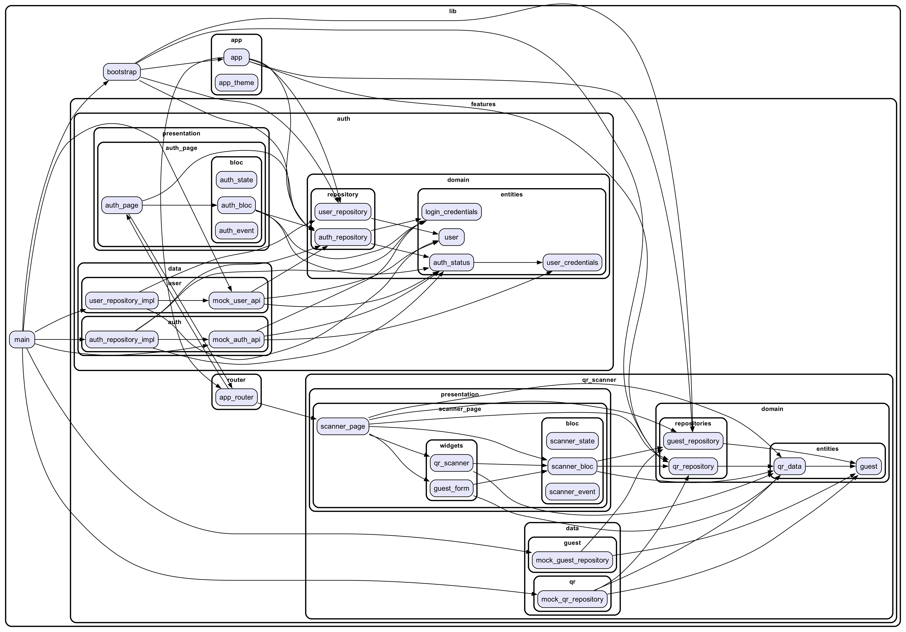

# QR Code Scanner for Event Moderators

This is a Flutter Web application for event moderators to scan QR codes. The application is currently under development.

## Technology Stack

- **State Management**: [Bloc](https://pub.dev/packages/flutter_bloc)
- **Routing**: [auto_route](https://pub.dev/packages/auto_route)

## Screenshots

<p align="center">
  
  
  
  
  
  
</p>

## Getting Started

To get started with this project, clone the repository and run the following commands:

```bash
git clone https://github.com/itatmisis/admin_events_app.git
cd admin_events_app
flutter pub get
dart run build_runner build
flutter run
```

## Development Progress

This project is still in the development phase. Below is a list of planned features and the progress:

- [x] Set up project structure
- [x] Authentication
- [x] QR Code Scanning
- [x] Create user interface
- [ ] Backend Integration (pending backend development)

## Architecture

The current architecture of the application is illustrated below:

